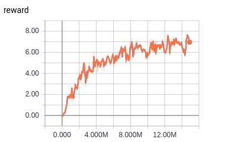
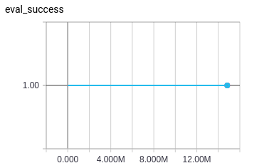
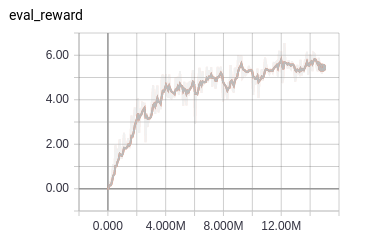
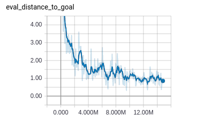

# DDPPO

End-to-end algorithm which win Habitat-challenge-2019

## Training and validation tendency graphics

###Training:
####Reward obtain

###Validation:
####Success

####Reward

####Distance to goal

## Built With

* [DDDPPO](https://arxiv.org/pdf/1911.00357.pdf) - The article the project highly rely on
* [Code](https://github.com/facebookresearch/habitat-api/tree/master/habitat_baselines/rl/ddppo) - The code the project highly rely on
