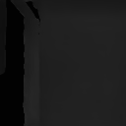
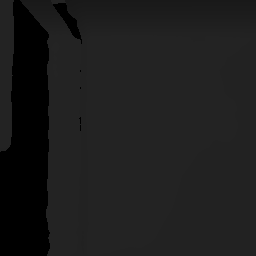

# Project Title

Mapper for extracting depth-maps from monocular-rgb-images

## Examples of working with map-plan baseline agent

Videos of agent is reaching the pointgoal, predicted depth maps and true depth maps

| image from camera | predicted depth | true depth |
| :---         |     :---:      |          ---: |
|    |      |    |

## Built With

* [DenseDepth](https://arxiv.org/abs/1812.11941) - The article the project highly rely on
* [Code](https://github.com/ialhashim/DenseDepth) - The code the project highly rely on
